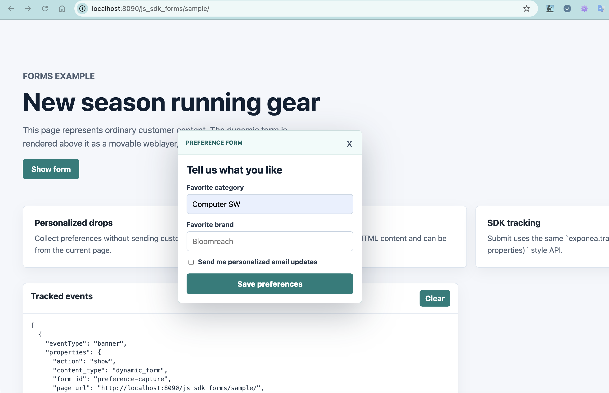
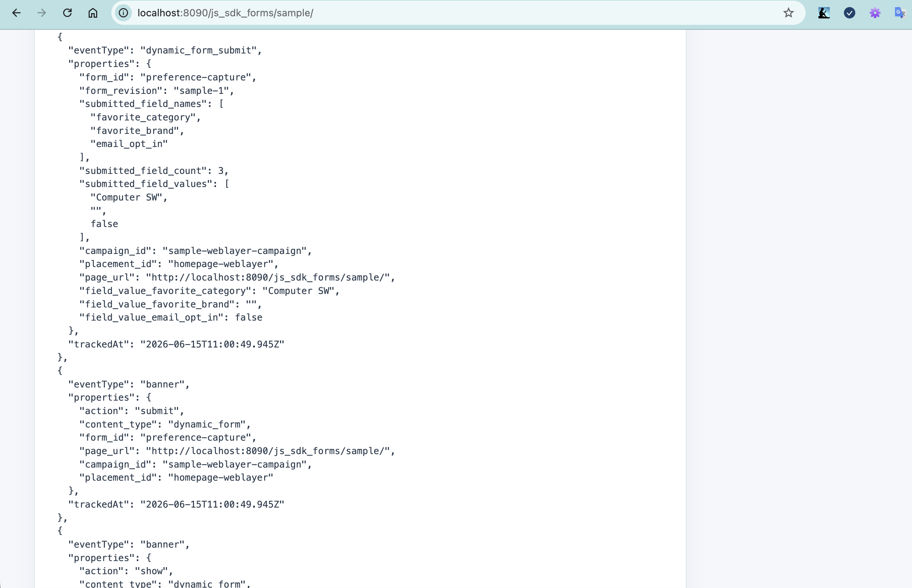

# JS SDK Dynamic Forms

This is a small, standalone prototype for Dynamic Forms in the JavaScript SDK.

For the assignment-level design, requirement coverage, API/payload contract, extensibility notes, and future testing strategy, see [`DESIGN.md`](DESIGN.md).

The goal is to show the simplest production-shaped split:

- `src/forms-core.ts`: fetch form definitions, validate, normalize, and submit through `exponea.track(...)`.
- `src/forms-renderer.ts`: dependency-free DOM rendering and draggable weblayer placement.
- `src/exponea-forms.ts`: JS SDK installer that adds `exponea.forms`. This mimicks how JS SDK could be extended with forms.
- `sample/`: plain HTML/CSS sample with a styled, draggable popup above page content.
- `example/forms/preference-capture.json`: sample form payload fetched by the sample app.

No React, bundler, or framework runtime is required. TypeScript is used only for source authoring and tooling; the browser sample loads compiled JavaScript from `dist/`. Of course this is just for a quick PoC.

## Why TypeScript Here

TypeScript makes the SDK-facing contracts easier to evolve: form definitions, field types, submitted values, renderer handles, and `exponea.forms` APIs are visible to editor tooling before runtime.

For a production SDK, I would not maintain these types by hand forever. The better long-term path is one source of truth for the form delivery contract, then generated artifacts:

- TypeScript types for SDK development and customer-facing API tooling.
- JSON Schema, or an equivalent runtime validator, for validating fetched payloads before rendering.
- The same contract metadata for marketer tooling, so a form created in the UI cannot publish a payload the SDK rejects.

That avoids drift between backend delivery, marketer-authoring tools, Web SDK rendering, and runtime payload validation.

## Build

After changing TypeScript:

```bash
npm install
npm run build
```

## Run The Sample

From the workspace root (i.e. from the parent directory of `js_sdk_forms/`):

```bash
python3 -m http.server 8099
```

Open:

```text
http://localhost:8099/js_sdk_forms/sample/
```

If your browser or extension setup treats `localhost` specially, use:

```text
http://127.0.0.1:8099/js_sdk_forms/sample/
```

The sample creates a mock `window.exponea`, installs `window.exponea.forms`, fetches a local form definition, renders it as a weblayer-style popup, and logs `banner` plus `dynamic_form_submit` events on the page.

## Screenshots

Draggable weblayer-style form:



Tracked events after form interaction:



## Proposed JS SDK API Shape

In the example fetched URL is expected to follow existing REST API style used in exponea

- ie. contain project, app, form ids ... etc.

```js
BloomreachForms.installExponeaForms(window.exponea, {
  fetchForm: ({ formId }) =>
    fetch(`/dynamic-forms/${formId}`).then((r) => r.json()),
});

const handle = await window.exponea.forms.show({
  formId: "preference-capture",
  placementId: "homepage-popup",
});
```

For custom placement:

```js
const definition = await window.exponea.forms.fetch({
  formId: "preference-capture",
});

window.exponea.forms.render(definition, document.querySelector("#slot"), {
  placementId: "inline-slot",
});
```

## Why This Shape

The core knows nothing about DOM. The renderer knows nothing about network or SDK configuration. The installer is the only layer that knows about `window.exponea`.

That is the important separation for JS SDK: the same form schema and submit tracking can be rendered inline, in a weblayer popup, or later inside existing campaign/weblayer orchestration.
